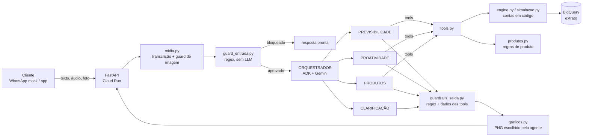

# ITA — backend

Agente de decisão financeira para a Batalha de Agentes Itaú.
FastAPI + Google ADK (Gemini 3.8 Flash) + BigQuery, publicado no Cloud Run.

O ITA conversa com o cliente no WhatsApp (mock em `/whatsapp`) e cobre três cenários: **previsibilidade**
(quanto dá para gastar, se o saldo vai ficar negativo), **proatividade** (avisos que partem de eventos do extrato)
e **produtos** (comprar, parcelar, crédito, onde pôr a sobra), sempre seguindo a Res. Conjunta nº 8.

## Apresentação

A pasta [`apresentação/`](apresentação/) tem páginas HTML autocontidas: é só abrir no navegador.

| Página | Conteúdo |
|---|---|
| [`arquitetura-agentes.html`](apresentação/arquitetura-agentes.html) | fluxo clicável, chamadas ao Gemini por rota, prompts de cada agente e motores em código |
| [`fluxo-agentes.html`](apresentação/fluxo-agentes.html) | caminho de uma mensagem: entrada, orquestrador, especialistas, conferência e resposta |
| [`telas-prototipo.html`](apresentação/telas-prototipo.html) | telas do WhatsApp e do app Itaú rodando contra a API de produção, por cenário ([capturas em `telas/`](apresentação/telas/)) |
| [`tom-de-voz.html`](apresentação/tom-de-voz.html) | como o ITA fala: princípios, tom por situação, forma no WhatsApp e exemplos reais |

---

# Desenho de solução

## Arquitetura

## Componentes

| Camada | Arquivos | Papel |
|---|---|---|
| Rotas | `app/routes/` | contrato HTTP e validação (Pydantic em `schemas.py`) |
| Controllers | `app/controllers/` | casos de uso; `chat.py` monta o pipeline mídia → guard → agentes → gráfico → trilha |
| Agentes | `app/agents/agentes.py` | orquestrador + 4 especialistas (ADK `LlmAgent` com `sub_agents`) |
| Tools | `app/agents/tools.py` | funções que os agentes chamam; leem o extrato e devolvem números prontos |
| Runner | `app/agents/runner.py` | Runner do ADK e sessões (`InMemorySessionService`) |
| Serviços | `app/services/` | motor financeiro, simulação, regras de produto, gatilhos, contratação (demo), gráficos, mídia, guards |
| Repositório | `app/repositories/extratos.py` | extrato por cliente no BigQuery (ou CSV local), com cache |
| Front | `web/` | protótipo do app (`/`) e conversa de WhatsApp (`/whatsapp`) ligados à API |

### Agentes

| Agente | Quando entra | Tools |
|---|---|---|
| ORQUESTRADOR | toda mensagem; responde saudações e transfere o resto | — |
| CLARIFICAÇÃO | mensagem vaga ou ambígua ("preciso de 2 mil") | — (saída estruturada: pergunta + 2–3 botões) |
| PREVISIBILIDADE | gastar até o salário, saldo futuro, PLR/13º, gastos, conceitos | `ate_salario`, `projetar_saldo`, `comparar_gastos`, `simular_dinheiro_extra`, `buscar_lancamentos` |
| PROATIVIDADE | cliente respondendo a um gatilho do ITA | as mesmas de previsibilidade |
| PRODUTOS | compra, parcelamento, crédito, sobra, escolha de cenário | `simular_cenarios`, `avaliar_produtos`, `ate_salario`, `buscar_lancamentos` |

Botão de clarificação ou resposta a gatilho chegam com a rota definida: o orquestrador transfere direto,
sem chamar o Gemini (`before_model_callback`). O raio-X do cliente é carregado antes de cada especialista
(`before_agent_callback`), sem gastar chamada de tool.

### Ferramentas

| Tool | Devolve |
|---|---|
| `ate_salario(gasto)` | quanto dá para gastar até o próximo salário, com e sem o gasto |
| `projetar_saldo(dias)` | saldo dia a dia, menor saldo, primeiro dia negativo, conta que causa o aperto |
| `comparar_gastos(dias)` | gasto por categoria vs média dos 3 meses anteriores |
| `simular_dinheiro_extra(valor, quitar)` | parcelas quitadas, alívio mensal, quanto fica guardado |
| `buscar_lancamentos(categoria, descricao, dias)` | lançamentos e total ("quanto gastei com iFood?") |
| `simular_cenarios(cenarios, necessidade, ...)` | aplica as regras, remove cenários de produto bloqueado, simula o resto e decide a oferta |
| `avaliar_produtos(necessidade, ...)` | regras aplicadas, produtos bloqueados com motivo e a oferta (sem compra para simular) |

O `id_usuario` das tools vem do estado da sessão, nunca de argumento do Gemini: um agente não consegue ler o
extrato de outro cliente.

## Dados

- **Fonte:** tabela `hackathon_dados.extrato_sintetico` no BigQuery (`id_usuario, anomesdia, anomes, tipo, descr,
  vlr, nom_cate_macro, nom_cate_micro, saldo_apos, parcela_atual, parcela_total`). `TIPO_SAIDA` define o valor de
  `tipo` que indica saída.
- **Acesso:** query parametrizada por cliente; lote com `UNNEST(@ids)` para jobs e demo; cache em memória por
  cliente (`CACHE_TTL`, 10 min).
- **Derivados (sem persistência):** o motor calcula perfil (renda, contas fixas, parcelas, sobra, comprometimento),
  projeção, alertas e gatilhos a cada chamada. Os resultados das tools ficam no estado da sessão ADK e vão para o
  front em `dados_tela`.
- **Sem GCP:** `scripts/gerar_dados_teste.py` gera um CSV sintético no mesmo formato (`DATA_SOURCE=csv`), usado
  nos testes e embutido na imagem Docker.
- **Regras de produto:** vêm da planilha `ITA_arvore_decisao_regras_produtos.xlsx` (Matriz_Regras R001–R013),
  codificadas em `produtos.py`.

## Integrações

| Serviço | Uso |
|---|---|
| Vertex AI (Gemini 3.8 Flash, endpoint `global`) | agentes, transcrição de áudio e classificação de foto; retentativa em 429/503 |
| BigQuery | extrato do cliente |
| Cloud Speech-to-Text (Chirp), opcional | transcrição sem gastar cota do Gemini (`TRANSCRICAO=speech`) |
| Cloud Run | hospedagem da API e do front (`--session-affinity`, até 5 instâncias) |
| Cloud Build + Artifact Registry | CI/CD a cada push na `main` (`cloudbuild.yaml`: testes → build → push → deploy) |
| Cloud Scheduler, opcional | varredura diária de gatilhos em `POST /jobs/alertas` |
| Google ADK Dev UI | `adk web adk_agents` para testar os agentes isolados |

## Segurança

Camadas, na ordem em que a mensagem passa:

1. **Mídia (`midia.py`)** — tipo de arquivo e tamanho validados em código (`LIMITE_MIDIA_MB`). A foto é
   classificada pelo Gemini em JSON (tipo, valor, `tem_dado_pessoal`) e o **código** decide: documento, cartão,
   senha ou foto sem relação com dinheiro são bloqueados. Texto dentro da imagem é tratado como dado, não
   instrução (injeção indireta).
2. **Guard de entrada (`guard_entrada.py`)** — regex, sem LLM, custo ~0: bloqueia prompt injection, dados
   sensíveis (CPF, cartão, senha/CVV), pedidos ilícitos e pedidos fora do escopo, com resposta pronta. Áudio passa
   por aqui depois de transcrito. Padrões estreitos de propósito para não barrar "sofri uma fraude no cartão".
3. **Isolamento por cliente** — `id_usuario` vem da sessão; queries parametrizadas no BigQuery.
4. **Regras de produto em código** — elegibilidade, taxa, limite e oferta nunca vêm do LLM; a elegibilidade é
   simulada e toda oferta avisa que depende de análise de crédito.
5. **Guardrails de saída (`guardrails_saida.py`)** — sobre cada resposta: remove produto do banco citado sem oferta
   liberada, troca promessas proibidas ("garantido", "sem risco", "aprovado"), acrescenta o aviso de análise de
   crédito e marca para auditoria todo R$ ou % que não aparece nos dados das tools.
6. **Contratação só de demonstração** — gera protocolo, não contrata nada.
7. **Container** — roda sem root; credenciais por ADC (sem chave no código); limites de tamanho nos schemas.

## Observabilidade

- **Trilha por resposta:** o `/chat` devolve `trilha` com cada passo (mídia, guard, rota, tool com argumentos,
  regras aplicadas, guardrails acionados, gráfico). É o painel "por dentro" do front e serve de auditoria.
- **Logs estruturados em texto** (`logging`, logger `ita`) no Cloud Logging: tempo de cada `/chat`, rota, número de
  passos, bloqueios dos guards com motivo, falhas do Gemini com o código HTTP.
- **Auditoria de números:** o guardrail `numero_sem_origem` registra valores que o agente escreveu sem base nas tools.
- **Saúde:** `GET /health` (usado pelo `HEALTHCHECK` do Docker) e `GET /info` (modelo e fonte de dados).
- **Erros do Gemini** viram 503 (cota/alta demanda) ou 502 com motivo, em vez de 500 genérico.

## Tom de voz

O ITA fala como **alguém de confiança que entende de dinheiro**, conversando no WhatsApp com quem tem pouco
letramento financeiro. As regras estão no prompt de todo agente que escreve para o cliente
([`agentes.py`](app/agents/agentes.py): `REGRAS_RES8`, `FORMATO_WHATSAPP`, `COMO_RESPONDER`, `EXEMPLOS`); o que é
objetivo também é conferido em código pelos guardrails de saída.

**Princípios**

- **Educa antes de resolver:** explica o que está acontecendo com o dinheiro dele antes de sugerir um caminho.
- **Recomenda sem pressionar:** diz o que faria e por quê, sem julgar, e termina devolvendo a escolha ao cliente.
- **Honesto com os números:** só usa valores das tools, mostra o custo total (não só a parcela) e marca como
  "hipotética" a taxa que o cliente não informou.
- **Sem promessas:** nada de "garantido", "sem risco" ou "aprovado" (o guardrail troca por linguagem neutra).
- **Espelha o cliente:** se ele escreve curto e informal, a resposta é curta e informal.

**Tom conforme a situação**

| Situação | Tom | Exemplo |
|---|---|---|
| Aperto ou saldo negativo | acolhedor e direto, frases curtas, no máximo 1 emoji, sem aula; foco no que dá para fazer já | "Vou ser direto: do jeito que está, a conta entra no vermelho dia *12/03*, logo depois do aluguel." |
| Sobra ou boa notícia | pode comemorar e convidar a planejar | "Que mês bom! 🎉 Você não entrou no negativo nenhuma vez e ainda sobraram *R$ 640*." |
| Pergunta pontual | leve e objetivo, de 1 a 3 frases | "Dá sim 🙂 Mesmo gastando *R$ 200* hoje, você chega ao salário do dia *05/02* com uns *R$ 380* de folga." |
| Decisão com caminhos | compara, recomenda e devolve a escolha | "Eu iria de *B*: são só 2 meses de espera e você não paga juros de cheque especial. Qual faz mais sentido para você?" |
| Mensagem ambígua | pergunta curta e acolhedora, com botões | "Posso te ajudar de dois jeitos 🙂 O que faz mais sentido agora?" |

Os avisos proativos ([`gatilhos.py`](app/services/gatilhos.py)) seguem o mesmo critério: tom **positivo** para fim
de parcela e mês no azul, **neutro** para aumento de entradas e dia do salário, e **negativo** (acolhedor) para
pressão financeira e gasto fora do normal. A abertura é sempre educativa, nunca oferta.

**Forma no WhatsApp**

- Trata por "você", palavras do dia a dia; nada de "prezado" nem jargão ("fluxo de caixa", "liquidez").
- Parágrafos de 1 a 3 frases; listas só com 3 ou mais itens comparáveis.
- Negrito do WhatsApp (`*R$ 1.200,00*`) só em valores, datas e na recomendação; valores em `R$ 1.234,56` e datas
  em `dia/mês`.
- No máximo um emoji por título ou parágrafo.
- Tamanho proporcional à pergunta: pontual em até 3 frases, situação em 60–130 palavras, decisão em até 200
  palavras (sem contar o bloco de oferta).
- Abertura pelo que mais importa agora (o sim/não, o número principal, a boa notícia ou o alerta), nunca uma
  fórmula fixa; estrutura e títulos variam entre respostas.

---

# Documento técnico resumido

## Decisões e justificativas

| Decisão | Por quê | Custo aceito |
|---|---|---|
| Números só em código (tools + motor), LLM só interpreta e escreve | LLM erra conta; em finanças um número errado é o pior defeito | mais tools e mais código determinístico |
| Orquestrador + especialistas por cenário | prompts menores e focados; cada especialista só vê as tools do seu cenário | uma chamada extra de roteamento (evitada quando a rota vem do botão ou do gatilho) |
| Agente de clarificação com botões | perguntar é melhor que adivinhar em mensagem ambígua; o botão dispensa novo roteamento | um turno a mais na conversa |
| Regras de produto em código a partir da planilha | oferta é decisão regulada e auditável; elegibilidade ≠ recomendação | regras rígidas, mudança exige deploy |
| Guards de entrada e guardrails de saída em regex, sem "Guardião Gemini" | custo e latência ~0, comportamento previsível e testável | não pegam variações que só um modelo pegaria; as regras da Res. 8 também ficam no prompt |
| Foto: Gemini classifica, código decide | só um modelo sabe o que a foto é, mas a decisão de bloquear fica determinística | uma chamada ao Gemini por foto |
| Agente escolhe o gráfico numa linha de controle; código desenha | o gráfico conta a história da resposta, com dados das tools | parsing da linha `GRAFICO:` |
| `THINKING_LEVEL=LOW`, temperatura 0.65 nos especialistas | as contas estão nas tools; respostas mais rápidas e escrita menos repetitiva | menos raciocínio em casos complexos |
| Cloud Run + BigQuery + Vertex | serviços gerenciados do projeto do hackathon, deploy em minutos | sessões em memória por instância |
| Camadas `routes → controllers → services/agents → repositories` | regras testáveis sem HTTP e sem LLM | mais arquivos |

## Limitações

- **Sessões em memória** (`InMemorySessionService`): somem quando a instância reinicia; `--session-affinity`
  mantém a conversa na mesma instância, mas não é garantia.
- **Elegibilidade simulada:** a base não tem dados de crédito nem atraso de dívida; "dificuldade grave" é inferida
  por dias no negativo. Taxas de produto são ilustrativas quando o cenário não traz a taxa.
- **Projeção por médias** dos últimos 90 dias para o gasto variável; eventos únicos não são previstos.
- **Dados sintéticos de 2025:** a data de hoje entra no prompt para o agente não confundir o ano do extrato.
- **Guards por regex** cobrem padrões conhecidos; paráfrases novas de injection podem passar (o prompt e os
  guardrails de saída são a segunda linha).
- **API pública sem autenticação** e CORS aberto (`--allow-unauthenticated`, `allow_origins=["*"]`), adequado
  só para a demo.
- **Cota do Gemini:** picos geram 429; há retentativa, mas não fila.
- **Contratação** é só demonstração; o WhatsApp é um mock, não a API do WhatsApp Business.

## Estratégia de testes

`pytest -q` (55 testes em `tests/test_ita.py`), rodando **sem rede e sem GCP**: dados do CSV sintético e um
`GeminiFalso` (subclasse de `BaseLlm`) no lugar do modelo. O mesmo comando é o primeiro passo do Cloud Build; se
falhar, não há deploy.

| Nível | O que cobre |
|---|---|
| Motor | perfil (contas fixas, parcelas), projeção com compra, juros, comparação, alertas, até o salário |
| Tools | simulação de cenários (compra, consórcio, poupar), busca de lançamentos, gastos por categoria, dinheiro extra |
| Regras de produto | casos da aba "Exemplos" da planilha: inadimplente sem crédito, carro agora vs em 2 anos, sobra sem reserva, empréstimo para contas, oferta só com cenário saudável, elegibilidade por dívidas |
| Guards e guardrails | bloqueios de entrada e falsos positivos (pergunta legítima passa), produto sem oferta, promessas, aviso de crédito, auditoria de números |
| Mídia | data URI e base64, tipo e tamanho recusados, guard de imagem (aceita, bloqueia documento, dado pessoal, resposta sem formato) |
| Pipeline do `/chat` | ponta a ponta com o Gemini falso: saudação, tool certa por pergunta, produtos com regras + oferta + guardrails, clarificação e botão, gatilho, áudio passando pelo guard, foto bloqueada sem chamar agentes |
| API e front | endpoints, gráficos em PNG, simular/contratar, front servido na raiz |

Qualidade de linguagem e aderência à Res. 8 com o Gemini real foram avaliadas manualmente na demo, com clientes
reais da base escolhidos por `/demo/candidatos` e `/demo/gatilhos`.

---

Regra das camadas: `routes -> controllers -> services / agents -> repositories`. Uma camada só chama a
de baixo. Os services não conhecem FastAPI; o único que chama o Gemini é o `midia.py` (transcrição do
áudio e leitura da foto), porque é conversão de mídia, não conversa com o cliente.

## Princípio

O chat é feito de agentes Gemini que decidem, recomendam e escrevem; os números
vêm de tools que buscam o extrato no BigQuery e calculam em código (`tools.py`,
`simulacao.py`, `engine.py`). Quais produtos podem
aparecer e se há oferta é decidido pelas regras de `produtos.py`, não pelo LLM. As regras da Res. Conjunta nº 8 estão no prompt de cada agente e os guardrails
de saída conferem cada resposta em código antes de ela chegar ao cliente.

## Endpoints

| Método | Rota | Para quê |
|---|---|---|
| GET | `/clientes?limite=20` | lista ids |
| GET | `/demo/candidatos?limite=100` | acha a melhor "Camila" para a demo |
| GET | `/demo/gatilhos?limite=60` | clientes em que cada gatilho acontece de verdade |
| GET | `/clientes/{id}/perfil` | raio-X (tela inicial) |
| GET | `/clientes/{id}/projecao?dias=90` | saldo dia a dia (gráfico) |
| GET | `/clientes/{id}/ate-salario?gasto=0` | quanto dá para gastar até o salário |
| GET | `/clientes/{id}/movimentacoes?limite=8` | últimos lançamentos |
| POST | `/clientes/{id}/simular` | uma forma de compra (`valor, parcelas, entrada, meses_espera, taxa_juros_mensal`) |
| POST | `/clientes/{id}/comparar` | compara caminhos e recomenda (`valor, parcelas`) |
| GET | `/clientes/{id}/alertas` | avisos proativos (aperto, parcela terminando, sobra -> reserva/investir) |
| GET | `/clientes/{id}/gatilhos` | gatilhos proativos e a mensagem de abertura |
| POST | `/clientes/{id}/produtos/simular` | parcela, custo total e capacidade de um produto ofertado |
| POST | `/clientes/{id}/produtos/contratar` | contratação de demonstração (protocolo) |
| POST | `/graficos` | PNGs para dados já calculados (atalhos do menu) |
| POST | `/jobs/alertas?limite=50` | varredura para o Cloud Scheduler |
| POST | `/chat` | conversa com os agentes (`id_usuario, mensagem, session_id?, rota?, gatilho?, audio?, imagem?`) |
| GET | `/health`, `/info` | saúde e configuração |